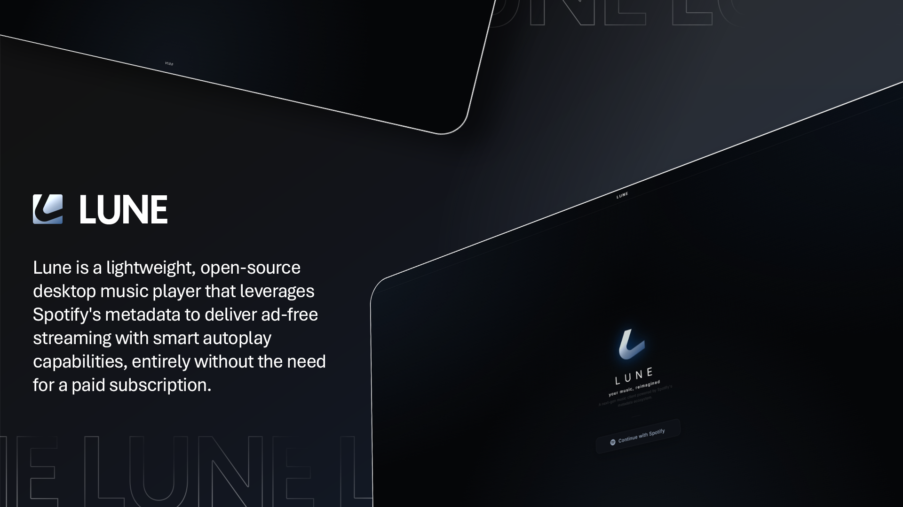
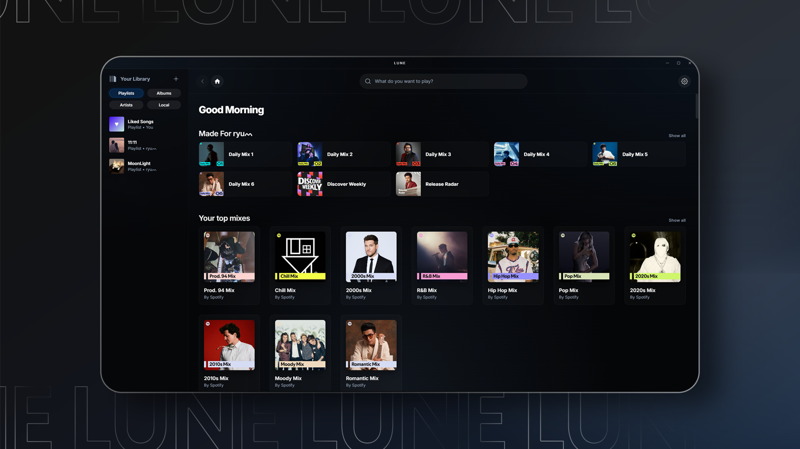
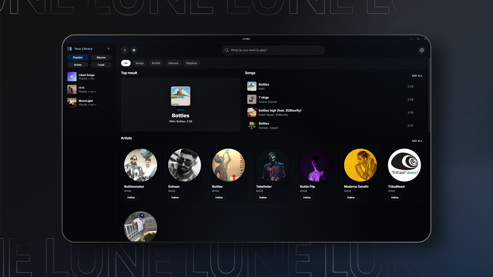
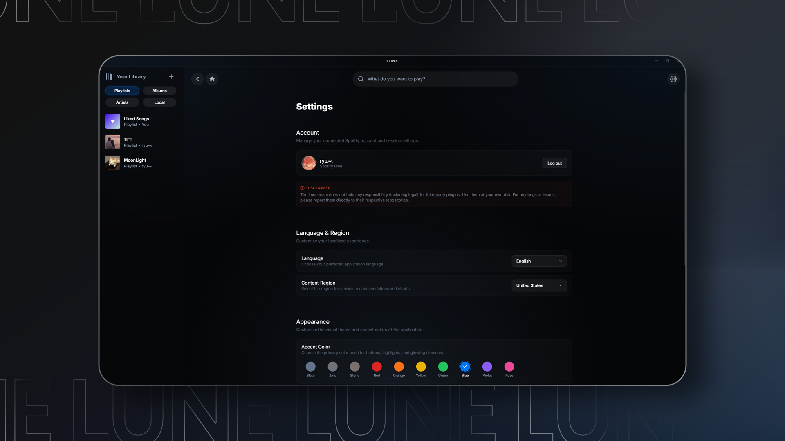

  

   

  <h1>─── ✧ L U N E ✧ ───</h1>

  
Lune is a lightweight, open-source desktop music player that leverages Spotify's metadata to deliver ad-free streaming with smart autoplay capabilities, entirely without the need for a paid subscription. Built for performance and beautifully designed, it offers a fast and distraction-free environment for your entire music library.

   

  

    
    
    
    
  

 

  
  <table border="0" cellpadding="0" cellspacing="0" width="100%">
    <tr>
      <td width="50%"></td>
      <td width="50%"></td>
    </tr>
    <tr>
      <td colspan="2"></td>
    </tr>
  </table>

 

### / Features

- ✦ **Ad-Free Experience** — Enjoy uninterrupted listening with a smart, ad-free streaming engine without requiring a paid subscription.
- ✦ **Offline Downloads** — Save any track, album, or playlist directly to your local device for high-speed, offline playback.
- ✦ **Unified Library Management** — Create custom local playlists and seamlessly mix them with your saved Spotify collections.
- ✦ **Hybrid Streaming Engine** — Merges Spotify's rich metadata and recommendation ecosystem with high-quality audio streams.
- ✦ **Dynamic Audio Quality** — Automatically scales streaming quality based on your network, or force high-bitrate playback.
- ✦ **Synced Lyrics integration** — Real-time, scrolling lyrics support powered by LRCLib so you can sing along perfectly.
- ✦ **Pure Minimalism** — A breathtaking interface designed to stay out of your way, focusing entirely on the cover art and the music.
- ✦ **Extensive Customization** — Tailor the app to your setup with interchangeable HSL-based accent colors and density modes.
- ✦ **Cache & Storage Control** — Take full control of your disk space with intelligent caching and one-click data management.
- ✦ **Desktop Optimized** — Deep OS integration including media keys, hardware acceleration, and seamless background behavior.
- ✦ **Rich Presence** — Built-in native Discord integration to share your current track and library status with friends.
- ✦ **Infinite Library Virtualization** — Hyper-optimized architecture that allows for buttery-smooth scrolling even with thousands of saved tracks.
- ✦ **Global Localization** — Fully translated into multiple languages including English, Hindi, and more.
- ✦ **Seamless Updates** — Built-in automatic updater ensures you are always running the latest and most stable version of Lune.

 

### / Tech Stack

Lune is built on a modern, high-performance stack designed for the desktop:

- **Logic**: [React 18](https://reactjs.org/) + [TypeScript](https://www.typescriptlang.org/)
- **Desktop Foundation**: [Electron 30](https://www.electronjs.org/)
- **Build Tooling**: [Vite 5](https://vitejs.dev/)
- **Database**: [Better-SQLite3](https://github.com/WiseLibs/better-sqlite3) for persistence and unified library management.
- **Audio Engine**: `yt-dlp` for optimized stream harvesting and download management.
- **Presence**: [Discord-RPC](https://github.com/discordjs/RPC) for seamless social integration.
- **Styling**: Pure, high-performance Vanilla CSS with a focus on modern glassmorphism and HSL-based design systems.

 

### / License

Lune is proudly open-source and licensed under the **[GPL-3.0 License](https://github.com/saraansx/Lune/blob/main/LicENSE)**.

This ensures that the project remains free and open. Any modifications or derivative works distributed to others must also be open-source and released under the same license.

 

  <h3>
    
    Star History
  </h3>
  <a href="https://star-history.com/#saraansx/Lune&Date">
    <picture>
      <source media="(prefers-color-scheme: dark)" srcset="https://api.star-history.com/svg?repos=saraansx/Lune&type=Date&theme=dark" />
      <source media="(prefers-color-scheme: light)" srcset="https://api.star-history.com/svg?repos=saraansx/Lune&type=Date" />
      
    </picture>
  </a>

---

  ✦ Lune ─ Crafted for the Aesthetic Listener ✦

